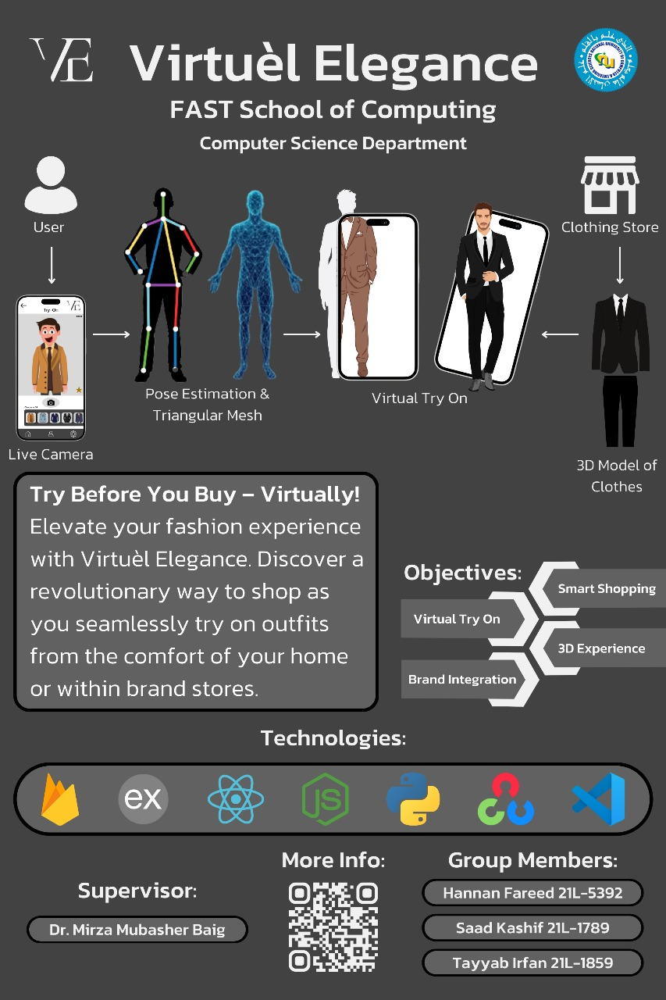

# 👗 Virtual Elegance – Virtual Try-On Platform  

## 📌 Overview  
**Virtual Elegance** is a cross-platform **mobile and web application** that enables users to virtually try on outfits in real time.  
The system leverages **pose estimation** and **3D visualization** to deliver an interactive, realistic, and immersive clothing try-on experience.  

---

## ✨ Features  
- 📱 **Cross-Platform App**: Built with React Native & ReactJS for mobile and web support.  
- 📸 **Real-Time Pose Estimation**: Uses **OpenCV** and **MediaPipe** to capture body measurements from live camera input.  
- 🧍 **Body Tracking**: Enhanced accuracy with **OpenPose** for human pose detection.  
- 👗 **3D Clothing Visualization**: Integrated **Unity 3D** for realistic garment rendering.  
- ☁️ **Cloud-Backed**: Uses **Firebase** for authentication, storage, and real-time database.  
- 🔗 **Flask + NodeJS APIs**: Backend services for handling AI models and application logic.  

---

## 🛠️ Technologies Used  
- **Python** 🐍  
- **OpenCV** – Computer vision for body detection  
- **MediaPipe** – Real-time pose estimation  
- **OpenPose** – Advanced pose detection framework  
- **ReactJS** ⚛️ – Web interface  
- **React Native** 📱 – Mobile app  
- **NodeJS** – Backend services  
- **Firebase** 🔥 – Authentication & storage  
- **Flask** – AI/ML API integration  
- **Unity 3D** 🎮 – Clothing simulation & rendering  

---

